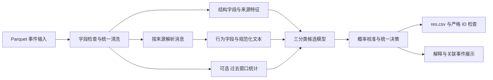

# SF-2026-02 第一性原理方案与现有工作复核

日期：2026-09-11。

本报告完整阅读附件 2 第二题，直接审计本地 `data/data` 全量训练与验证数据，在阅读旧方案和旧代码前保存独立设计判断，再核查现有实现、历史报告和保存模型。目标是确定这个项目现在应该怎样做，以及哪些既有结论需要修正。本次没有改动原项目源码、配置、训练数据或保存模型，没有提交比赛结果。

**核心判断：当前最重要的工作是识别数据中的标签捷径、建立能够区分不同能力的验证体系，并解决已定位的误报。模型复杂度不是第一瓶颈。** 一棵只使用绝对时间和产品名称的浅树，在完整本地验证集上取得 0.999431 Macro-F1，明显高于保存的旧 CatBoost 的 0.916683。这证明当前高分可以主要来自数据构成规律，不能单凭高分推断模型理解了攻击行为。

建议在同一个项目中维护竞赛特征配置和行为特征配置，先让最简单可解释基线站稳，再用实际难例证明文本、时序或更复杂模型的增益。当前没有证据支持把 GNN、LLM、TabPFN 或外部数据迁移列为前置必做项。

## 一 赛题真正要求什么

### 1 输入 输出和交付

题目编号为 **SF-2026-02**，发榜单位为中国移动通信集团浙江有限公司。

输入是脱敏 SOC 安全事件，预测单位是一条事件。监督目标为三个离散类别：

- `benign`：正常事件。
- `suspicious`：数据标注定义的可疑事件。
- `malicious`：数据标注定义的恶意事件。

字段虽然名为 `label_binary`，实际是三分类。不能因为列名而二值化；也不能把模型低置信度直接转换为 `suspicious`。模型不确定性和标注的可疑类别是两个不同概念。

正式输出为 `res.csv`，包含 `event_id,pred_label`。系统按 ID 匹配，输入与输出 ID 集合必须完全一致，不缺失、不多余、不重复；预测值只能是上述三类。附件对本题没有指定 `gbk`，第三题的编码要求不能照搬过来，默认 UTF-8 并待官方补充说明核实即可。

系统还需覆盖数据读取、特征处理、模型训练、威胁分类、解释和可视化。题目介绍包含攻击链分析，但没有给出链级标签、链级提交字段和链级评分公式。因此第一版应把事件分类作为核心，并提供有证据可回溯的关联事件视图；不能把按时间连接的若干记录宣称为已验证的攻击因果链。

附件说明测试集在结果提交开始前 3 天公布，初赛提交预测文件打榜，模型文件另以网盘链接提交组委会。应提前完成可重放推理与输出检查。本次没有进行上传或对外发送。

### 2 评价口径中的确定与不确定

附件列出准确率、召回率、F1、AUC、少数类识别能力、速度、鲁棒性与可解释性，但**没有规定唯一排名公式、F1 的平均方式或各指标权重**。由于最终 CSV 只包含硬标签，AUC 需要概率分数，其是否来自模型复核或其他环节也未说明。

因此内部先使用 Macro-F1 选型，同时保留逐类 Precision／Recall／F1、混淆矩阵、恶意类 AP、OVR ROC-AUC、正常误报数和耗时。Macro-F1 是暂定内部目标，不能称为已确认的官方主指标。本次公开检索没有找到可替代附件的官方明确评分公式；其他队伍仓库不作为赛题规则依据。

需要向组委会核实的最少信息是：排名公式；本地验证答案的角色及可用范围；最终测试字段与脱敏方式；额外数据和测试批内上下文是否允许。上述未知不妨碍先完成数据分析、固定评估与模型开发。

## 二 全量数据揭示的真实问题

### 1 数据清单和标签比例

实际数据目录为 `data/data`，不是 `SF02/data`。三个文件均可正常读取。

| 数据 | 行数 | benign | malicious | suspicious |
|---|---:|---:|---:|---:|
| train.parquet | 2,056,871 | 1,899,723，92.3599% | 111,728，5.4319% | 45,420，2.2082% |
| valid_input 与对应答案 | 2,014,052 | 1,959,573，97.2951% | 14,052，0.6977% | 40,427，2.0072% |

`valid_answer_private.parquet` 的 ID 与验证输入一一匹配。本次使用它进行分布诊断和冻结模型评价，没有把其中标签加入训练，也没有用其答案搜索树深度或决策阈值。文件名不能证明它是最终测试答案，也不能单凭文件存在认定官方允许将其用于训练。它现在至少是已被本次分析查看的本地诊断集，不能再称为完全未触碰的最终测试。

类别不均衡确实存在，但恶意样本已有 11 万余条，不能简单归因于“样本数太少”。真正稀缺的可能是独立攻击场景、日志来源和行为变化。百万行不等于百万个独立情景。

全预测 benign 在验证集 Accuracy 为 97.2951%，Macro-F1 仅 0.328763。因此单看 Accuracy 会掩盖安全检测失败。

### 2 实际只有 11 个可建模输入字段

训练集 13 列：12 个输入列（包括 ID），加 1 个标签列。去掉 `event_id` 后，可直接使用的原始字段只有：

`timestamp, pipeline, src_ip, dst_ip, src_port, src_host, dst_host, username, message_sanitized, product_name, vendor_name`。

题面提到的独立 `event_type`、`action`、`severity`、`protocol`、`dst_port`、厂商事件码和攻击技术标签，在实际表中没有对应独立列。部分可以从原始消息提取，但必须报告解析覆盖率，解析失败保留未知，不能视为全量已有。

| 字段 | 训练缺失或空字符串 | 验证缺失或空字符串 | 对建模的影响 |
|---|---:|---:|---|
| src_ip | 1,424,068 | 739,253 | 大量事件没有源 IP；不能把空值作为一个真实实体 |
| dst_ip | 1,877,632 | 1,947,771 | 绝大多数记录不支持完整源目的关系 |
| src_port | 1,796,777 | 1,830,057 | 端口特征覆盖有限；部分值是脱敏字符串 |
| dst_host | 1,671,207 | 1,427,627 | null 与空字符串的区别高度关联标签 |
| username | 1,417,673 | 782,656 | 不能默认用户行为链完整可用 |
| message_sanitized | 356,315，17.3232% | 954,292，47.3817% | 文本分支在接近一半验证数据上没有内容 |

训练消息平均长度约 1,550 字符，最长 76,954 字符；验证平均约 1,023 字符，最长 71,999 字符。Parquet 压缩后的文件大小远小于解压文本的内存占用。百万行文本应列投影、分批处理和缓存解析结果，不能根据约 127 MB 的压缩文件误判内存需求。

真实样本也显示脱敏替换会侵入词语、JSON 键、XML 标签和数字。并非所有“看起来是 JSON”的消息都能完整解析。应按来源优先解析稳定片段，再回退到容错模板／文本特征。`src_ip` 中存在 `HOST-...` 等非 IP 值；合法地址也可能是重映射产物，不能据私网前缀直接推断真实内外网拓扑。

### 3 决定性发现之一 绝对时间完整区分恶意样本

以下时间统一为 UTC：

| 数据与类别 | 时间范围 |
|---|---|
| 训练 malicious | 2022-06-13 至 2024-07-18 |
| 训练 benign | 2024-07-26 至 2024-08-22 |
| 训练 suspicious | 全部位于 2024-07-26 约 50 分钟内 |
| 验证 malicious | 2022-05-30 至 2024-07-18 |
| 验证 benign／suspicious | 2024-07-26 至 2024-08-01 |

训练中 1,899,700 条正常样本位于 2024-07-26，其余仅 23 条。全部恶意样本均早于正常／可疑样本，验证也重复这一规律。

只看 `timestamp` 的小树，在本次验证中就能以 **100% Precision 和 100% Recall 识别 malicious**，但无法区分正常与可疑。这是一种明确的数据构成捷径。它不能证明“旧日期就是恶意”，也不能证明模型能识别未来新攻击。

由此还可推出：把整份训练数据按时间排序后机械按 80%／10%／10% 切分，后段没有恶意样本是数据结构导致的结果。不能把这类切分里的低三类 Macro-F1 简单解释为模型差，也不能通过重新随机混入旧攻击样本后仍称其为严格未来测试。

### 4 决定性发现之二 缺失编码直接暴露标签

全量训练中：

- `dst_host is null` 共 **111,728** 条，全部为 malicious。
- 全部 malicious 的 `dst_host` 都是 null。
- 正常与可疑没有这类 null，而是空字符串或有值。

验证中，该条件覆盖 13,996／14,052 条 malicious，且仍无正常或可疑误报。

所以即使删除绝对时间，模型也可以继续依靠缺失值的序列化形式识别数据来源。旧代码把 null 转为 `__MISSING__`，同时保留 `''`，恰好保留了该捷径。

这不是已经证明了标注错误，也不是断言使用该字段违反竞赛规则；它证明的是**缺失编码足以替代相当多的威胁判断**。行为能力实验必须将 null／空串／纯空白规范化，并检查原始文本是否还带有同样的来源线索。

### 5 决定性发现之三 产品名称高度决定可疑标签

例如：

- 训练 ASA Firewall：34,059 条可疑、20 条正常。
- 验证 ASA Firewall：38,473 条可疑、34 条正常。
- AWS VPC Security：训练 10,620 条、验证 1,853 条，全部可疑。
- 训练 Falcon：35 条全部可疑；验证 Falcon：91 条可疑、801 条正常。

前两个来源使“产品名查表”非常有效，Falcon 则暴露了这种先验在来源内部变化时会失效。产品名称可能携带真实业务先验，但无法单独支持“识别攻击行为”的结论，不能把某产品永久设为恶意／可疑。

### 6 实体重映射和重复模式

验证集中所有非空 `src_ip`、`dst_ip`、`src_host`、`dst_host`、`username` 字符串，在对应训练列中的覆盖率均为 **0%**。产品名和厂商则高度重合。

这说明当前验证面对的是新的实体标识。原始 IP／用户 ID 不应作为主干依赖；同一个数据文件内部的相对关系和重复频率仍可能有用，但需要验证脱敏映射的局部一致性。

两份数据的 ID 都从 `EVT-0000000001` 重新编号，验证 ID 字符串全部落在训练 ID 范围内，却对应不同事件。严禁按跨文件相同 `event_id` 连接训练标签与验证输入；关联键应包含数据集身份。训练按时间升序排列，验证大量相邻记录时间递减，ID／文件行序还可能间接编码标签位置。

| 重复定义 | 训练 | 验证 |
|---|---:|---:|
| 全部原始特征一致，排除 ID 和标签后的额外重复行 | 88,951，4.3246% | 11,080，0.5501% |
| 再排除 timestamp 后的额外重复行 | 1,336,656，64.9849% | 1,827,885，90.7566% |

上述重复口径先将 null 统一为空字符串，再对特征分组，未发现标签冲突。分组使用 pandas 64 位行哈希，属于工程审计口径；不将其称为原始字节相同或数学无碰撞证明。跨训练／验证没有相同的特征哈希，连去时间后的特征重合也为零，但实体重映射本身会造成这一结果，不能据此认定日志模板独立。

重复应分开处理：训练／验证分组要防同模式相互泄漏；用于行为统计的真实重复次数应保留；最终输出每一个 `event_id` 都必须保留。不能为了去重丢掉需要提交的事件。

## 三 从第一性原理推导技术方案

### 1 先分清要学的关系

学习目标可写成：`p(label | event_fields, available_context)`。实际数据中还存在一个未显式标出的变量：日志所属的数据来源、采集年代与脱敏处理方式。它同时影响输入形式和标签分布，因而模型可能学到的是“识别来源，再猜标签”。

当前结果说明，单纯提高网络容量不会自动得到更真实的威胁识别，反而可能更容易利用捷径。去掉一个字段也不够，因为绝对时间、缺失编码、产品、主机及文本格式可以互相替代。

此外，当前数据缺少与旧攻击同时间同来源的充分正常对照，也缺少新时期恶意样本。仅靠重切分无法补出这些未观测的事实。任何方法都不应承诺，仅凭这份数据就能证明开放环境安全检测能力。

### 2 推荐的最小架构



只有一套读取、特征处理、训练、评估和推理实现。用配置切换两种特征视角，不建设两套独立系统：

- **竞赛视角**：保留规则允许、预测时可见的字段，记录对时间、缺失编码和产品的依赖程度；以可信本地评价和最终官方指标为准。
- **行为视角**：不使用 ID、绝对日期和任意实体编码；统一缺失形式，规范化文本中的身份标识与日期；检验动作、状态、端口、事件码、模板和过去窗口统计能支持多少效果。

第二种视角的分数下降并不等于失败，它量化了第一种成绩有多少依赖数据构成。但即使行为视角仍很高，也要继续检查模板与标签来源是否混杂，不能直接宣布已消除所有捷径。

### 3 模型选择顺序

| 层次 | 具体方法 | 要回答的问题 | 进入后续的条件 |
|---|---|---|---|
| 最简对照 | 全正常、产品查表、缺失规则、浅树 | 数据是否已被少量字段决定 | 所有后续模型必须与它们比较 |
| 结构化候选 | CatBoost 直接三分类 | 多字段交互能否降低真实误报与漏报 | 在固定切分、固定难例分组上有增益 |
| 文本候选 | 规范化 n-gram／模板 + 线性分类器 | 消息内容能否区分同产品的不同标签 | 尤其改善 WAF、Falcon 和新模板样本 |
| 轻量上下文 | 过去窗口计数、不同目标数、失败率等 | 单条无法区分的样本是否需历史行为 | 时间与实体可用，且在线重放有增益 |
| 复杂候选 | 小型文本模型或图模型 | 前面特征仍无法表达什么具体关系 | 已定位表达瓶颈，增益超过成本 |

CatBoost 的类别处理适合本题大量类别字段，因此保留为优先比较对象；但本次实测已表明，不能预先指定它一定是最终主模型。其原生类别处理与有序统计有明确技术依据，但不能消除数据自身的来源混杂。[CatBoost 官方说明](https://catboost.ai/docs/en/concepts/algorithm-main-stages_cat-to-numberic)

第一版采用直接三分类。没有证据表明必须先正常／异常二分类再细分；两阶段容易在第一层截断召回。如果后续证明恶意与可疑确有不同的信息来源，再比较分层模型。多模型融合也不是必做：必须证明不同模型的错误互补，并把融合参数在开发集确定后冻结。

**当前竞赛基线应优先使用简单可解释模型作强对照，CatBoost 和文本模型负责挑战它；最终只交付最小且被验证有效的模型或融合。** 本次浅树是诊断实验，不直接晋升为完成的提交模型。

### 4 特征应怎样构造

**结构化清洗**：ID 保留为字符串且不入模；统一时区和单位；明确 null、空串、未知值；对真正合法的端口提取数值与区间，对无效值保留解析失败标记。字段缺失不应悄悄改变模型输入列顺序。

**消息解析**：先按 pipeline／product 判断日志家族。优先抽取实际可恢复的事件码、allow／deny、认证成功失败、协议、目的端口、请求动作、状态码、告警类型等。正则只针对确认过的日志结构；JSON／XML 解析失败回退到局部提取并保留状态，避免把未解析当正常。

**文本规范化**：IP、主机、用户名、UUID、脱敏占位符编号与嵌入日期可替换为类型标记，但保留事件码、服务端口、状态和动作语义。不能无差别删除所有数字，否则会同时毁掉 `4625`、`443` 等可能有用的信息。规范化器需要同时检查“是否清除了身份线索”和“是否误删行为差异”。

**双视角消融**：按组删除绝对时间及日期派生项、所有身份字段、产品／厂商／管道、缺失编码差异、文本身份标记。用同一固定样本切分分别比较，不能只删除 `src_ip` 就宣布消除了身份依赖。实际相对时间间隔可以保留；小时／星期若用于业务规律，需要按多个真实日期验证，当前训练主要只有一天正常背景，不足以支持周周期结论。

**过去窗口特征**：只在事件所属实体和时间确实可信时计算最近 1／5／30 分钟的事件次数、唯一目的地数、同事件码次数、认证失败比例等。先验证“主机字段代表终端还是采集器”。缺失实体不统一并入一个巨大群组；训练、验证与推理使用一致的因果边界，同时间戳默认整批处理，避免利用任意文件顺序制造先后关系。

滑动窗口的标签不能用于统计。目标编码、IDF、标准化、词表、频率参照等需要拟合的变换只从训练分区学习。用未来数据或测试标签构造特征会使分数乐观；将预处理封装在训练内的统一流程可减少这类问题。[scikit-learn 数据泄漏说明](https://scikit-learn.org/stable/common_pitfalls.html)

### 5 不均衡与决策规则

本题不宜把“增加恶意召回”作为唯一优化方向。旧模型当前恶意召回已经 100%，精确率只有 61.66%，继续盲目加大恶意权重可能扩大误报。

建议比较三个固定训练设置：无类别权重、温和权重（例如逆频率平方根）、现有逆频率权重。以相同划分上的逐类 P/R/F1 和误报数比较，不预设加权必然更好。当前保存模型的类别权重约为 `0.3603／6.2512／15.5153`，恶意和可疑相对正常权重较大。

对于已经具备良好概率排序的模型，先试独立开发分区上的概率校准与类偏置。统一决策可采用 `argmax(log(p_c + eps) + b_c)`，固定 benign 偏置为 0，另外两个偏置只在开发分区选择。不能同时设置互相冲突的多套阈值，也不能把被拒识样本全部写成 suspicious。

校准不是把加权概率机械当作真实发生率；训练与验证恶意比例变化约 7.8 倍，也不能在最终测试无标签时照搬验证比例。阈值和类别偏置需要记录适用分布。

不默认使用 SMOTE 合成类别 ID 或整条日志；这些插值缺少行为语义。开发期可以抽样正常样本加速，但保留少数类与来源多样性；正式评价保留自然比例。如按比例抽样训练，应记录抽样权重，避免把改变后的类别先验当成自然概率。

### 6 评价怎样才可信

不存在一个“用了 GroupKFold 就可信”的自动结论。建议采用以下互补评价：

| 评价 | 具体做法 | 它能证明什么 |
|---|---|---|
| 随机参照 | 分层随机切分 | 当前混合分布内拟合效果，容易受重复模式影响 |
| 实体／模板压力 | 固定实体、事件簇或规范化模板分组；报告组交集和类别支持数 | 对选定类型的新实体／新模板的能力 |
| 当前本地验证 | 训练仅来自 train，固定方案后评估 valid | 当前验证分布效果，含相同年代和来源捷径 |
| 表示不变性 | 重映射实体、统一缺失、整体平移 364 天并保持相对时间 | 对无关表示变化的依赖；不能代替真实新域 |
| 真正后续验证 | 官方未见测试或来源明确的新标注环境 | 对该实际新分布的效果 |

时间压力实验必须根据每个来源的真实时间覆盖设置。当前恶意与正常时间不重叠，无法用单个连续未来切分证明完整三分类性能。不要为填满三类而把历史数据塞回去，再误称严格时间外推。

Group 分组应基于明确的泛化问题。例如评估新来源主机就隔离源主机，评估新模板就隔离模板；多个实体字段拼接只能隔离“完全相同的组合”，不保证每个实体独立。对于共享采集器、网关或缺失值，不宜盲目构建连通分量，否则可能把大部分数据连成一个巨组。每一折都需要公开三类样本数、独立组数和来源覆盖。

同一官方验证集被反复用于选模型或阈值后，就是开发集而非独立确认集。应在后续新数据或官方最终测试上确认；不能在看过全部结果后通过重命名得到“未见测试集”。独立留出与分组方法的适用边界可参考官方文档。[scikit-learn 交叉验证说明](https://scikit-learn.org/stable/modules/cross_validation.html)

最低指标集：Macro-F1、各类 Precision／Recall／F1 与样本数、混淆矩阵、每万条正常事件误报数、恶意／可疑各自 AP、OVR ROC-AUC、按来源和是否新实体分组的结果，以及包含读取、处理、推理、导出的总时间。AP 与梯形积分 PR-AUC 不是相同计算，报告应标明方法。[AP 官方定义](https://scikit-learn.org/1.5/modules/generated/sklearn.metrics.average_precision_score.html)

单来源切片若只有 benign，固定三类 Macro-F1 可能显示 1/3，即使全部预测正确。这应标为类别支持不完整，报告实际出现类别的指标，不能直接据此排序来源或模型。重复日志很多时，不确定性应按实体／事件簇评估，不能把两百万条高度重复记录都当独立伯努利试验。

## 四 本次实测和旧工作评价

### 1 实验范围与结果

旧模型直接从磁盘载入，不重新拟合。简单查表和浅树仅从 train 学习，没有用验证答案搜索模型结构、权重或阈值。下表所有验证指标均来自完整 2,014,052 条本地验证事件。

| 方法 | 使用的信息 | Accuracy | Macro-F1 | malicious Precision | malicious Recall |
|---|---|---:|---:|---:|---:|
| 全预测正常 | 无 | 0.972951 | 0.328763 | 0 | 0 |
| 产品多数标签查表 | product_name | 0.992603 | 0.661955 | 0 | 0 |
| null 规则再产品查表 | dst_host 是否 null、product_name | 0.999553 | 0.995809 | 1.000000 | 0.996015 |
| 时间与产品浅树 | timestamp、product_name，最大深度 4 | 0.999933 | **0.999431** | 1.000000 | 1.000000 |
| 当前保存的 CatBoost | 原结构化 14 个特征 | 0.995242 | **0.916683** | **0.616613** | 1.000000 |

浅树在此验证集错 135 条，旧模型错 9,582 条。这个差距足以否定“先增加模型复杂度才会进步”的当前优先级，但不能把浅树当成已经证实可部署的安全检测器。它依赖的绝对日期捷径非常明显。

旧模型恶意 AP 为 1.0，OVR 宏平均 ROC-AUC 为 0.999989，说明当前验证上的概率排序与硬标签决策表现差异很大。实测真实恶意最小分数约 0.9542，非恶意最大分数约 0.5537。这提示校准／决策层值得优先检查；这些区间来自已查看答案，不能据此挑一个阈值后仍把同集成绩称为独立证明。

旧模型纯 `predict_proba` 阶段处理全量验证约 8.93 秒，CPU 4 线程，约 22.5 万事件／秒；不包含 CSV 导出，不能视为在线系统整体吞吐验收。当前机器可见 RTX 4060 Laptop 约 8 GB 显存，但上述结果不依赖 GPU，现阶段无需为了结构化基线先扩充 GPU 资源。

### 2 旧模型的错误全部可定位

| 产品 | 真实标签 | 错误预测 | 数量 |
|---|---|---|---:|
| Barracuda WAF | benign | malicious | 8,737 |
| Falcon | benign | suspicious | 801 |
| ASA Firewall | benign | suspicious | 34 |
| Symantec Data Loss Prevention | suspicious | benign | 9 |
| Duo | suspicious | benign | 1 |

下一轮应以这五组为难例目录。前两组优先解决，分别指向恶意阈值／来源变化与产品先验失效。但不能直接写 `Barracuda WAF = benign` 或 `Falcon = benign` 的修补规则，因为它们只是本次验证中出现的分布。

其中 DLP 是训练未出现的新产品；仅有 9 条验证记录，不能据此训练一个被证明可靠的新产品专用分类器。要依靠可迁移行为字段，或者收集独立标签证据。

### 3 值得保留的工作

- `SF02` 已有配置读取、Parquet 读取、统一特征函数、三分类训练、模型保存和 CSV 输出，足以作为继续开发的基础。
- 保留简单模型优先、dummy 对照、训练／验证／测试分开、消融实验和检查重复的方向。
- 旧报告已经意识到高分可能来自重复、实体和来源偏置，这个警觉是正确的。
- 保留文本与时序的扩展思路，但把它们改成以难例增益触发的可选能力。
- AIT 标签追溯到源日志行号的思路有价值，可以用于未来独立外测；现阶段不必继续下载多套大数据。

### 4 需要修正的结论和实现

**P0 高分解释过头。** 旧真实性报告将 `group_by:src_ip` 的约 0.994 解读为“学到一部分可泛化模式”。该证据至多支持此划分下未见 IP 的分类效果，不能排除日期、null 或产品捷径。本次两字段浅树和全量缺失交叉表提供了更直接的解释。最小修正：替换结论，加入按特征组去捷径、表示不变性与来源难例对照。依据：`SF02/artifacts/reports/model_reality_audit_20260630.md`，本次 `shortcut_diagnostics.json`。

**P0 分组名称与保证不一致。** `src/common.py:145` 实际调用 `GroupShuffleSplit`；`stratified_group` 没有真正执行类别分层。`common.py:94–106` 把多个实体拼成组合键，只保证组合不交叉。最小修正：准确命名，固定 split manifest；如需分层分组使用适当算法但仍检查可行性、实际三类支持数和每个实体交集。不可只更换一个 API 就宣布问题解决。

**P0 多种捷径未进入核心消融。** `common.py:67` 保留原始 timestamp，`common.py:56` 区分 null 与空字符串；旧消融默认不删除绝对时间、全部身份列或缺失差异。最小修正：在同一 split 上增加成组消融，竞赛和行为配置分别报告。单字段删除后高分仍在不能证明捷径已消除。

**P1 旧实体统计误把缺失值当实体。** 旧报告所谓最大 `src_ip` 1,424,042 次、最大 `username` 1,305,985 次，实际都是空字符串。最小修正：把缺失率与非空实体频率分开统计，重新检查分组规模。当前全量统计已更正。

**P1 尚无证据表明现有保存模型是全量训练结果。** 本地 `artifacts/runs.csv` 的记录均为 50,000 行，最近主要报告也是 50,000 行，保存模型路径固定为 `route_a_catboost.cbm`，缺少与训练清单绑定的 manifest。因此不能称为百万行全量模型。当前源码加载配置指向的旧数据副本，与本次 `data/data` 的 train／valid_input 已核对 SHA-256 完全相同，排除了数据文件换版这一解释。后续应按 run_id 保存模型、训练行清单、配置和源码版本。

**P1 固定逆频率权重与当前误报方向不匹配。** `10_baseline.py:90` 固定使用类别权重，默认 `MultiClass` 验证损失选迭代数；推理则直接 argmax，没有独立校准。最小修正：相同切分比较无权重／温和权重，冻结迭代和类偏置后做确认；盯住 WAF 和 Falcon 的误报。不能从当前观察直接断言误报只由权重造成，仍需消融确认因果。

**P1 提交校验不完整。** `common.py:255` 只检查列存在、非空和重复 ID，没有校验标签枚举、预期 ID 集合和列集合。当前预测脚本直接从输入构造输出，正常执行时会保持行数，但独立校验器不能识别漏行或多行。最小修正：校验器接受预期输入 ID，对写出后的 CSV 重新读取并核对列、ID 集合、唯一性、行数及三类枚举。

**P1 源路径和产物需要归一。** 现有配置读 `C:/Users/xiabutian/sf02_data/data`，用户当前指定的是工作区 `data/data`。两者目前字节相同但未来可能漂移。最小修正：以工作区真实源数据和显式配置目录解析路径；每次运行记录输入 SHA。模型、解析器、标签顺序和特征列表放在同一产物目录，避免后一次小样本实验覆盖正式模型。

**P2 缺失时间的填充按每个数据分区自行算中位数。** `common.py:67` 在训练、验证和推理分别从当前批次计算中位数。当前官方三表 timestamp 无缺失，因此不是本次性能问题；但外部数据有缺失时会形成训练推理差异。最小修正：固定训练得到的填充值或使用明确缺失处理，带入模型产物，并用不同批大小重放检查一致性。

**P2 旧路线把太多可选项排成必做。** 旧合并版和增补版将 TF-IDF、时序、SHAP 等排成统一必做进度，并讨论 TabPFN、Transformer、LLM ATT&CK 映射。现在已有更具体的问题：数据捷径、误报、字段覆盖。最小修正：保留满足题意的解释与展示，其他模块必须回答具体误差原因并通过增量比较后再加入。

### 5 AIT 外测应该如何重新定位

AIT-LDS v2 是有多源日志和攻击步骤标注的模拟企业测试床，可用于独立的跨场景研究。但官方标签是攻击相关事件及攻击步骤，不是本题同语义的三分类。未匹配标签的日志可在其规定范围内视为正常；这不授权把侦察统一映射成比赛 suspicious、把其他攻击步骤统一映射成 malicious。[AIT 官方数据说明](https://zenodo.org/records/5789064)

目前本地项目有外测脚本，但当前 `artifacts/reports` 没有对应已完成 AIT 模型评价或域适配结果。不能据文件存在认定外测已完成；云端是否有其他结果本次没有验证。

现有适配还存在几个会改变结论的问题：

- `32_ait_build_eval_dataset.py:176` 将所有 `dst_host` 设置为 None，而本次已证明这个表示在比赛训练中几乎等于 malicious。直接外测可能先测到缺失编码捷径的失效。
- 同文件 `:141` 将第一个、第二个出现的 IP 当作源／目的 IP，缺少日志语义确认；`:105` 对 Apache 时间丢弃原始偏移再强设 UTC，会影响跨源对齐。
- 同文件 `:189` 只找 `dataset.yaml`，官方说明为 `dataset.yml`。实际包若遵循官方命名，元数据会静默变空，导致无年份 syslog 时间解析失败。
- `collapse_labels` 使用人为三分类映射；benign 抽样倍数 3.0 改变自然比例，而且只从有标签文件取背景。所得精确率不能代表完整环境告警负担。
- `34_domain_adapt_eval.py:58` 用随机分层把同一目标场景拆成适配／测试，相邻日志、主机与攻击步骤可能同时出现在两侧。目标域适配后的分数不是零样本迁移分数，也不是跨场景验证。
- Runbook 的 russellmitchell MD5 少了最后一位。当前官方 v2.0 页列值为 `78e9b7d169b438f03816019b52ab3ff7`。此处是本次线上复核所得，未据此下载数据。[官方文件条目](https://zenodo.org/records/5789064)

正确顺序应为：先完成当前官方数据的诊断和最小改进，再按 AIT 原生任务建独立评估，优先保留攻击／正常和原始攻击步骤，不制造一个看似同名、实际异义的三分类。按场景或主机／时间块隔离，并保留自然背景评价。只有输入和标签语义可比较，才讨论迁移效果；外部数据混入训练需要另做消融，不能因外测低分就自动扩大系统。

## 五 优化后的具体执行顺序

以下是后续实施方案。耗时按当前已有 Python 工程粗估，不是比赛日程承诺；本次完成的是分析和诊断，没有自动开始改造训练主线。

### 阶段 1 固定数据契约和实验身份 约 0.5 至 1 天

以当前工作区数据为源，锁定 schema、ID、三类顺序、数据与模型 SHA。把本地验证明确定义为开发／诊断用途，查明官方对其答案的允许范围。用 split manifest 固定训练内的事件索引与分组；保存简单查表／浅树、旧模型作为可重复对照。

验收：一个统一评估入口能复现本报告全量旧模型与简单模型结果；输入文件变化可被识别；每折有类别和来源支持数；提交校验器能发现漏 ID、多 ID、重复和非法标签。

### 阶段 2 解决当前误报与捷径依赖 约 1 至 3 天

在相同切分上跑以下最小实验矩阵：

| 编号 | 特征与处理 | 目的 |
|---|---|---|
| E0 | 本次产品查表、null 规则、两字段浅树 | 固定最简强对照 |
| E1 | 旧结构字段，分别无权重与温和权重 | 验证权重是否导致误报扩大 |
| E2 | 删除 ID、绝对时间及所有任意实体编码，统一缺失 | 量化去掉主要捷径后的剩余效果 |
| E3 | E2 再去掉产品／厂商／管道 | 量化来源先验贡献，允许分数下降 |
| E4 | E2 加解析出的事件码、动作、状态和端口 | 验证行为字段增益 |
| E5 | 仅在 E4 尚有同产品混淆时加规范化文本 | 验证是否改善 Falcon／WAF 等难例 |

不把这六行扩成大规模超参数搜索。使用 10 万至 30 万开发样本加速时，要在固定训练分区内抽样并保留稀有来源；最终选定少量候选后再全量拟合。去身份实验同时检查文本中是否仍有身份信息；浅树和旧模型也参加表示不变性检查。

验收：交付同一评估协议下的三类 P/R/F1、来源错误数量和变化原因；所选模型必须有超过最简对照的实际价值，或者以显著更少的捷径依赖换取有明确意义的稳健性。不能以总体平均分掩盖某个产品全体误报。

### 阶段 3 只针对无法区分的行为补上下文 约 2 至 4 天 可选

先人工查看跨产品、跨标签的独立模板样本，尤其是表现相似但标签不同的 deny／drop 记录。如果单条缺少必要证据，再验证实体映射与事件时间，补过去窗口聚合。认证失败后成功、短期多目标扫描等是可验证的行为假设，而不是将一次失败直接判为攻击。MITRE 的暴力破解检测描述也强调高频失败、后续成功和相关实体的组合，但本项目只有在字段可恢复时才能实现这类分析。[MITRE T1110](https://attack.mitre.org/techniques/T1110/)

验收：按真实时间重放，换批大小结果一致；跨切分没有未来信息；有明确的难例改善。如果时间与实体不可用或没有增益，就停在单事件模型。只有聚合无法表达已确认的关系、且有足够独立情景时再考虑 GNN。

### 阶段 4 解释 展示和提交工程 约 1 至 2 天

最小展示包括：三类数量及来源分布、事件筛选、原始日志及解析结果、预测分数、关键依据、相邻关联事件和导出。解释必须区分“模型受产品／日期影响”与“观测到某种行为证据”。SHAP 可用于少量代表样本，不需要对全部百万记录预计算。

若展示 ATT&CK，只在有对应行为证据时给可能技术及依据，不把高危端口或单次失败硬映射为攻击技术。LLM 可帮助组织已有证据，不能补写日志里没有的攻击过程。没有链级真值时，展示叫“关联事件时间线”，不报告攻击链检测准确率。

交付模型包应包含模型、特征契约、解析器／词表、标签顺序、决策参数、依赖版本、训练来源和评估摘要。一个命令从输入 Parquet 生成结果；坏输入明确失败；导出后重读校验；保存端到端用时和内存测量。已有简单工程可扩展，无需 Kafka、图数据库或微服务集群。

### 阶段 5 最终测试公布后的三天窗口

先只检查输入 schema、行数、ID、缺失、时间覆盖、新产品和新模板比例，再运行冻结候选并完成 CSV 校验。若字段或分布变化，记录采取的适配及证据；未获允许时不用测试标签训练，也不把全批未来事件统计混入在线能力声明。

按实际官方指标选择提交产物，保留可复现模型包。比赛榜单、离线验证和真实 SOC 泛化分别陈述；一个环节通过不替代其他环节。

## 六 现在的决策

**继续使用已有 SF02 工程，先修验证解释、缺失规范、校准和提交契约。保留 CatBoost 作为候选，同时把简单规则与浅树提升为必须比较的强基线；文本与上下文根据具体误差进入，外部迁移和复杂模型后置。**

相较旧路线，最大的改变是投入顺序：当前不是从 0.994 继续堆特征到 0.996，而是先承认两字段已能达到 0.99943，再证明新增模块提供了什么现有数据捷径无法替代的能力。最有价值的创新应落在脱敏日志的可恢复行为特征、来源变化下的误报控制、以及能暴露捷径依赖的验证方法上。

当前能够确认：数据已全量审计；旧模型在当前完整验证集的效果已实测；简单对照足以解释极高分数；具体误报来源和多项工程问题已定位。尚未确认：新行为模型实际成绩、去捷径后的性能、最终官方评分公式、最终测试表现、真实 SOC 或 AIT 场景泛化。

## 附录 复核证据与复现

### 本地证据

- 赛题正文提取：`analysis_2026-09-11/official_task2_extracted.txt`，完整第二题段落 26–48；原文件二维码为答疑群入口，不是本题算法规格。
- 旧方案阅读前的独立判断：`analysis_2026-09-11/independent_design_before_prior_review.md`。
- 全量结构、缺失、分布、样本与重复审计：`analysis_2026-09-11/data_summary.json`、`train_profile.json`、`valid_input_profile.json`。
- 时间、缺失交叉表及训练侧简单规则验证：`analysis_2026-09-11/shortcut_diagnostics.json`。
- 旧模型全量验证、混淆矩阵、错误来源和概率排序：`analysis_2026-09-11/existing_model_full_valid.json`。
- 原代码版本：SF02 HEAD 为 `711893f`，提交时间 2026-06-29；工作区存在用户已有未提交修改，本次均保留。上述代码评审针对当前工作区文件，非仅针对 HEAD。
- 运行环境：Python 3.12.14，pandas 3.0.4，NumPy 2.5.0，CatBoost 1.2.10，scikit-learn 1.9.0，PyArrow 24.0.0。

### 文件身份

| 对象 | SHA-256 |
|---|---|
| 附件 2 DOCX | `091B5B234FC6C06C69EEA79B4A71944845F6550C84606ADCFDE27940ABCADB3F` |
| 当前 train.parquet | `6B6D5E23CAEBFD1C4F6B70C9E58C27F437BCA7F0CD26497EEFA3E4908F2CB742` |
| 当前 valid_input.parquet | `731AF597711AAE0B870912C36FC1A0F592FD6E53D911C7FEC6FE1405EC1A97B0` |
| 当前 valid_answer_private.parquet | `11D8C34DA6FDDC823E9DC8E12DE41BD8B66801D914E4A39B2B7E3161DE082A56` |
| 当前 route_a_catboost.cbm | `E17E43D748CE7E7FE417916049925EEEDCE4CD949E64D83BF57C70B293FB295E` |

### 复现命令

在项目根目录以 PowerShell 执行：

```powershell
$env:PYTHONIOENCODING = 'utf-8'
$env:PYTHONDONTWRITEBYTECODE = '1'
& '.\SF02\.venv\Scripts\python.exe' '.\analysis_2026-09-11\audit_data.py'
& '.\SF02\.venv\Scripts\python.exe' '.\analysis_2026-09-11\shortcut_diagnostics.py'
& '.\SF02\.venv\Scripts\python.exe' '.\analysis_2026-09-11\evaluate_existing_model.py'
```

前两项会覆盖本次分析目录中同名审计结果；第三项只加载原模型，不训练，不改原模型。浅树作为诊断只在脚本中拟合，不生成比赛提交文件。完整文本审计内存和耗时明显高于只读结构字段的推理，这两种成本不应混为一谈。
